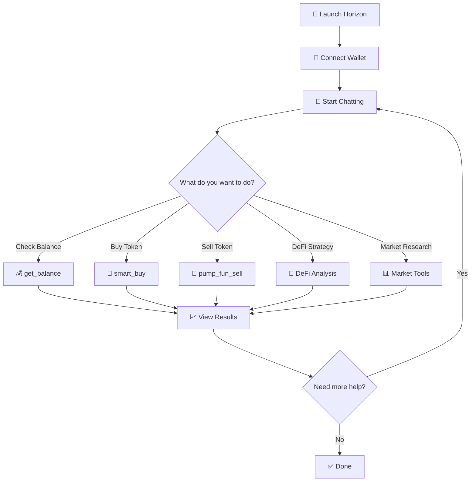

# 🌅 Horizon

<div align="center">
  
  
  **THE AI TACTICIAN FOR ONCHAIN TRADING**
  
  *Eliminate manual execution and constant monitoring. Manage complex, time-sensitive transactions and execute optimal trading strategies autonomously.*
</div>

---

## 🎯 What is Horizon?

Horizon is an AI-powered trading agent that transforms how you interact with the Solana blockchain. Instead of manually monitoring markets and executing trades, Horizon understands natural language commands and autonomously manages your onchain operations.

### The Problem We Solve

Traditional DeFi trading requires:
- ⏰ **24/7 Market Monitoring** - Constant attention to price movements
- 🎯 **Perfect Timing** - Executing trades at optimal moments
- 🔄 **Complex Strategies** - Managing multiple positions and rebalancing
- ⚡ **Time-Sensitive Actions** - Reacting to market conditions instantly

**Horizon eliminates these challenges** by providing an intelligent agent that can understand your trading intentions and execute them autonomously.

---

## 🚀 Key Features

### 🤖 **AI-Powered Trading**
- Natural language command processing
- Intelligent trade execution
- Context-aware decision making
- Autonomous portfolio management

### 🔧 **Comprehensive Tool Suite**
- **Wallet Management**: Balance checks, transfers, portfolio overview
- **Token Trading**: Buy/sell via Jupiter DEX and Pump.fun
- **Market Analysis**: Real-time prices, trending tokens, pair analysis
- **Research Tools**: Web search for market intelligence
- **Prediction Markets**: Polymarket integration for market sentiment

### 🔐 **Enterprise-Grade Security**
- Encrypted private key storage
- Secure transaction validation
- Rate limiting and safety limits
- Comprehensive error handling

### 📊 **Real-Time Intelligence**
- Live market data integration
- DexScreener analytics
- Price monitoring and alerts
- Market trend analysis

---

## 🏗️ Architecture

```
┌─────────────────────────────────────────────────────────────┐
│                    Horizon Frontend                         │
│  ┌─────────────────┐  ┌─────────────────┐  ┌──────────────┐ │
│  │   Chat Interface│  │  Wallet Manager │  │  Market      │ │
│  │   (Streamlit)   │  │                 │  │  Analytics   │ │
│  └─────────────────┘  └─────────────────┘  └──────────────┘ │
└─────────────────────────────────────────────────────────────┘
                              │
                              ▼
┌─────────────────────────────────────────────────────────────┐
│                    AI Agent Core                            │
│  ┌─────────────────┐  ┌─────────────────┐  ┌──────────────┐ │
│  │   LLM Engine    │  │   Tool Registry │  │  Memory      │ │
│  │   (OpenAI/Claude│  │   (15+ Tools)   │  │  Management  │ │
│  └─────────────────┘  └─────────────────┘  └──────────────┘ │
└─────────────────────────────────────────────────────────────┘
                              │
                              ▼
┌─────────────────────────────────────────────────────────────┐
│                Blockchain Integrations                      │
│  ┌─────────────────┐  ┌─────────────────┐  ┌──────────────┐ │
│  │   Solana        │  │   Jupiter       │  │  Pump.fun    │ │
│  │   (Core)        │  │   (DEX)         │  │  (Meme)      │ │
│  └─────────────────┘  └─────────────────┘  └──────────────┘ │
│  ┌─────────────────┐  ┌─────────────────┐  ┌──────────────┐ │
│  │   DexScreener   │  │   Polymarket    │  │  Web Search  │ │
│  │   (Analytics)   │  │   (Prediction)  │  │  (Research)  │ │
│  └─────────────────┘  └─────────────────┘  └──────────────┘ │
└─────────────────────────────────────────────────────────────┘
```

---

## 🚀 Quick Start

### Prerequisites

- Python 3.11+
- Solana wallet with private key
- API keys for LLM provider (OpenAI, Anthropic, or XAI)

### Installation

```bash
# Clone the repository
git clone https://github.com/horizonai-app/horizon_ai/
cd horizon

# Install dependencies
uv sync

# Set up environment
cp .env.example .env
# Edit .env with your API keys and configuration
```

### Configuration

Create a `.env` file with your credentials:

```bash
# Required
SAM_FERNET_KEY=your_encryption_key_here
LLM_PROVIDER=openai  # or anthropic, xai

# LLM API Keys
OPENAI_API_KEY=sk-...

# Optional
SAM_SOLANA_RPC_URL=https://api.mainnet-beta.solana.com
DEFAULT_SLIPPAGE=2
MAX_TRANSACTION_SOL=1000
```

### Running Horizon

```bash
# Start the Streamlit web interface
uv run streamlit run examples/streamlit_app/app.py

# Or use the CLI
uv run sam
```

---

## 🔄 User Flow

### Getting Started with Horizon



### Typical User Journey

#### 1. **Initial Setup** 🏁
```
User: "I want to start trading with Horizon"
Horizon: "Welcome! Let's get your wallet connected and check your balance."
→ User provides private key
→ Horizon: "Wallet connected! You have 5.2 SOL ($1,040) ready to trade."
```

#### 2. **Portfolio Check** 📊
```
User: "What's in my wallet?"
Horizon: "Your portfolio:
         💰 SOL: 5.2 ($1,040)
         🪙 BONK: 1M tokens ($25)
         🪙 RAY: 50 tokens ($15)
         Total Value: $1,080"
```

#### 3. **Token Discovery** 🔍
```
User: "Find me trending tokens"
Horizon: "Here are today's trending tokens:
         🚀 PEPE: +45% (High volume)
         🎯 DOGE: +23% (Stable growth)
         ⚡ SHIB: +67% (Volatile)
         Would you like to analyze any of these?"
```

#### 4. **Smart Trading** 🤖
```
User: "Buy 0.1 SOL of PEPE"
Horizon: "Executing trade...
         ✅ Bought 1,250,000 PEPE tokens for 0.1 SOL
         💰 Remaining balance: 5.1 SOL
         📊 Position: +2.3% in 5 minutes"
```

#### 5. **DeFi Strategy** 🎯
```
User: "Create a DeFi strategy for 2 SOL"
Horizon: "Analyzing opportunities...
         🏛️ Recommended allocation:
         • Raydium LP (SOL/USDC): 40% - 12.5% APY
         • Orca Yield Farm: 35% - 18.7% APY  
         • Solend Lending: 25% - 8.2% APY
         Expected portfolio APY: 13.8%"
```

#### 6. **Risk Management** 🛡️
```
User: "What's my risk exposure?"
Horizon: "Portfolio risk assessment:
         🟢 Low Risk: 25% (Lending)
         🟡 Medium Risk: 40% (LP)
         🔴 High Risk: 35% (Yield farming)
         Overall: Moderate risk profile
         💡 Consider diversifying across more platforms"
```

### Advanced User Flows

#### **DeFi Portfolio Management**
```
1. User: "Analyze my DeFi positions"
2. Horizon: Scans all positions across platforms
3. User: "Rebalance my portfolio"
4. Horizon: Calculates optimal allocation
5. User: "Execute rebalancing"
6. Horizon: Executes trades across platforms
```

#### **Market Research & Trading**
```
1. User: "Research trending memecoins"
2. Horizon: Analyzes market data and social sentiment
3. User: "What's the best entry point for PEPE?"
4. Horizon: Provides technical analysis and recommendations
5. User: "Buy 0.05 SOL with 3% slippage"
6. Horizon: Executes trade with specified parameters
```

#### **Yield Optimization**
```
1. User: "Find the best yield opportunities"
2. Horizon: Scans all DeFi platforms for yields
3. User: "Create a yield strategy for 5 SOL"
4. Horizon: Designs diversified yield portfolio
5. User: "Implement the strategy"
6. Horizon: Executes all positions automatically
```

### Key User Interactions

| **User Intent** | **Horizon Action** | **Tools Used** |
|-----------------|-------------------|----------------|
| Check balance | Show complete portfolio | `get_balance()` |
| Buy token | Execute smart buy | `smart_buy()` |
| Sell token | Execute sell order | `pump_fun_sell()` |
| Find yields | Scan opportunities | `get_defi_yield_opportunities()` |
| Analyze token | DeFi potential analysis | `analyze_token_defi_potential()` |
| Portfolio strategy | Create allocation plan | `create_defi_portfolio_strategy()` |
| Market research | Search and analyze | `search_pairs()`, `get_trending_pairs()` |
| Risk assessment | Evaluate positions | Multiple analysis tools |

---

## 💡 Usage Examples

### Natural Language Trading

```
User: "Check my wallet balance"
Horizon: "Your wallet contains 2.5 SOL ($500) and 3 tokens:
         - BONK: 1,000,000 tokens ($25)
         - WIF: 500 tokens ($150)
         - USDC: 100 tokens ($100)"

User: "Buy 0.1 SOL worth of BONK"
Horizon: "Executing buy order for 0.1 SOL worth of BONK...
         ✅ Successfully purchased 4,000 BONK tokens"

User: "What's trending on Solana right now?"
Horizon: "Current trending tokens on Solana:
         1. WIF - $0.30 (+15% in 24h)
         2. BONK - $0.000025 (+8% in 24h)
         3. POPCAT - $0.45 (+22% in 24h)"
```

### Advanced Trading Strategies

```
User: "Set up a DCA strategy for SOL"
Horizon: "I'll help you set up Dollar Cost Averaging for SOL.
         How much SOL do you want to invest per interval?"

User: "Research the latest news about Jupiter token"
Horizon: "🔍 Researching Jupiter token...
         📰 Latest news: Jupiter announces new features...
         📊 Market sentiment: Bullish (+12% in 24h)
         💡 Recommendation: Consider accumulating on dips"
```

---

## 🛠️ Available Tools

| Category | Tool | Description | Example |
|----------|------|-------------|---------|
| **Wallet** | `get_balance` | Check wallet balance | "Show my SOL balance" |
| **Trading** | `transfer_sol` | Send SOL | "Send 0.5 SOL to [address]" |
| **Trading** | `swap` | Token swaps via Jupiter | "Swap 1 SOL to USDC" |
| **Trading** | `pump_fun_buy` | Buy meme tokens | "Buy 0.1 SOL of [token]" |
| **Analysis** | `get_token_price` | Get token prices | "What's the price of BONK?" |
| **Analysis** | `get_trending_pairs` | Trending tokens | "Show trending Solana tokens" |
| **Research** | `search_web` | Web research | "Research [token] news" |
| **Prediction** | `polymarket_search` | Prediction markets | "What do markets think about [event]?" |

---

## 🔧 Development

### Project Structure

```
horizon/
├── sam/                    # Core framework
│   ├── core/              # Agent, LLM, memory, tools
│   ├── integrations/      # Blockchain integrations
│   ├── config/            # Settings and prompts
│   └── utils/             # Utilities and security
├── examples/
│   ├── streamlit_app/     # Web interface
│   ├── plugins/           # Custom plugins
│   └── sdk/               # SDK examples
└── tests/                 # Test suite
```

### Adding New Tools

```python
from sam.core.tools import Tool, ToolSpec

async def my_tool_handler(args: Dict[str, Any]) -> Dict[str, Any]:
    # Your tool logic here
    return {"success": True, "result": "..."}

def register(registry, agent=None):
    registry.register(Tool(
        spec=ToolSpec(
            name="my_tool",
            description="What this tool does",
            input_schema={"type": "object", "properties": {...}},
            namespace="my_integration",
            version="1.0.0"
        ),
        handler=my_tool_handler
    ))
```

### Testing

```bash
# Run all tests
uv run pytest tests/ -v

# Run with coverage
uv run pytest tests/ --cov=sam

# Run specific test
uv run pytest tests/test_tools.py::test_balance_check
```

---

## 🔐 Security

- **Private Key Encryption**: Fernet encryption with OS keyring integration
- **Input Validation**: Pydantic models for all inputs
- **Rate Limiting**: Built-in API rate limiting
- **Transaction Limits**: Configurable safety limits
- **Error Handling**: Comprehensive error management

---

## 📊 Performance

- **Async Architecture**: Non-blocking operations
- **Connection Pooling**: Efficient RPC connections
- **Caching**: Smart caching for frequently accessed data
- **Memory Management**: Context compression for long sessions

---

## 🤝 Contributing

1. Fork the repository
2. Create a feature branch
3. Make your changes
4. Add tests
5. Submit a pull request

### Code Style

- Python 3.11+ with type hints
- 100-character line length
- Async-first architecture
- Comprehensive error handling

---

## 📄 License

MIT License - see LICENSE file for details.

---

## 🏆 Hackathon Submission

**Horizon** was built for the Solana hackathon with the following goals:

- ✅ **Innovation**: First AI agent framework for Solana
- ✅ **Usability**: Natural language interface
- ✅ **Functionality**: 15+ blockchain tools
- ✅ **Security**: Production-ready security measures
- ✅ **Scalability**: Extensible plugin architecture

### Demo Video

[Link to demo video showcasing Horizon's capabilities]

### Live Demo

[Link to live demo instance]

---

## 📚 Documentation

Comprehensive documentation is available in the [`docs/`](./docs/) directory:

- **[AI Agent Architecture](./docs/ai-agent-architecture.md)** - Core system architecture and components
- **[Tool System](./docs/tool-system.md)** - Tool development and management guide
- **[LLM Integration](./docs/llm-integration.md)** - Language model integration details
- **[Security Architecture](./docs/security-architecture.md)** - Security implementation and best practices
- **[Documentation Overview](./docs/README.md)** - Complete documentation index

## 📞 Support

- **Documentation**: [Complete docs in `docs/` directory](./docs/)
- **Discord**: [https://discord.gg/thatweb3gee]
- **Twitter**: [@HorizonSolana]
- **Email**: support@horizon-solana.com

---

## 🙏 Acknowledgments

Horizon is built on the SAM Framework - a production-ready AI agent middleware for Solana blockchain operations.

---

<div align="center">
  **Built with ❤️ for the Solana ecosystem**
  
  *Horizon - Where AI meets DeFi*
</div>